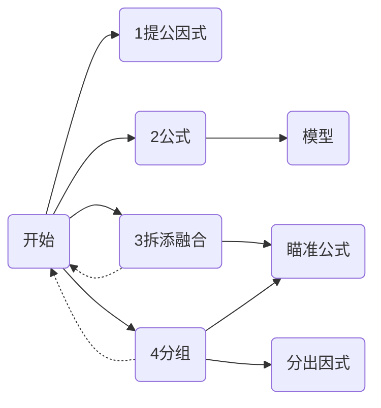

## 什么是因式分解

因式分解,说白了就是把多项式化为既约式.  
既约式: 无法在特定集合内分解的就是既约式.  
特点: 结果唯一,形式乱来.  
Eg:  

$$
(5x+3)(4x+8) = (4x+\frac{12}{5})(5x+10)
$$

## 基本思路

**本文不讲解提公因式这类基本方法**

## 公式/模型
[戳这里\~\(^_^\)\~](https://github.com/dogs0/JM/blob/main/因式分解/Note1.md)

## 拆分融合
瞄准公式来拆添:  
 **例题:**  
> 在整数域分解: $x^4+x^2+1$  

 **分析**  
 将 $x^4+x^2+1$ 中x的次数降下来  
 得到: $(x^2)^2+(x^2)+1^2$  
 此时与公式: $(a+b)^2=a^2+2ab+b^2$ 很像  
 但少了 $x^2$  
 正巧有公式: $a^2-b^2=(a+b)(a-b)$  
 就有答案了  
 **解:**  
> 原式   
> $= (x^2)^2+(x^2)+1^2$   
> $= (x^2)^2+2(1 x^2)+1^2-(1 x^2)$    
> $= (x^2+1)^2-x^2$    
> $= (x^2+x+1)(x^2-x+1)$   

## 分组  
瞄准公因式:   
**例题:**   
> 在整数域分解: $x^3-x^2+x-1$   
**解:**  
> 原式    
> $= (x^3-x^2)+(x-1)$    
> $= x^{2}(x-1)+(x-1)$    
> $= (x^2+1)(x-1)$  

瞄准公式:    
**例题:**    
> 在整数域分解 $x^5-x^4-x^3+x^2$  

**分析:**  
先分组提取公因式  
得到: $x^{3}(x^2-1) - x^2(x^2-1)$    
提公因式: $(x^2-1)(x^3-x^2)$  
将 $(x^2-1)$ 分解得: $(x+1)(x-1)$  
**解:**  
> 原式  
> $= (x^5 - x^3)-(x^4 - x^2)$    
> $= x^3(x^2 - 1^2)-x^2(x^2 - 1^2)$  
> $= (x^2 - 1^2)(x^3-x^2)$  
> $= x^2(x+1)(x-1)^2$  

## EOF
好了,初联基础因式分解就到这(剩下的是模型,或者去看提高)  
